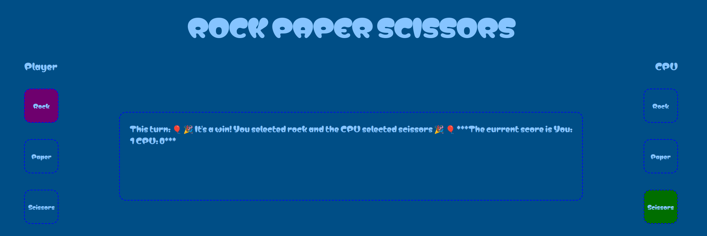

# Rock-Paper-Scissors Game README

Welcome to the most adrenaline-pumping, edge-of-your-seat action you can find in a few lines of JavaScript—it's **Rock-Paper-Scissors**! 🎉

## How to Play

[Play the Game Here!](https://opuslearning.github.io/RPS/)

### 1. Start the Game
As soon as the page loads, you’re all set to play. The score starts at zero for both you and the CPU. The race to 5 points begins now!

### 2. Make Your Choice
- **Rock:** Click the Rock button if you believe in the power of solid defences. 🪨
- **Paper:** Click the Paper button if you think a good offence is a piece of cake. 📄
- **Scissors:** Click the Scissors button if you prefer to cut through the competition. ✂️

### 3. The CPU Responds
The CPU will randomly pick Rock, Paper, or Scissors. Don’t be fooled by its cold, calculating nature—it’s just as capable of making a terrible decision as you are!

### 4. Winning & Losing
- **Rock** crushes **Scissors**.
- **Scissors** cuts **Paper**.
- **Paper** covers **Rock**.
- If you and the CPU make the same choice, it’s a draw—no harm, no foul.

### 5. Score to Win
The first to reach 5 points is crowned the champion! You’ll either bask in the glory of victory or nurse your pride if the CPU takes the crown.

## Features

### Colour-coded Feedback
- When you make a selection, your choice button will glow with a royal purple hue. 👑
- The CPU’s choice will be highlighted in a victorious green. 💚

### Fun Messages
- **Draw?** You’ll get a shrugging emoji and a "try again" message.
- **Win?** Get ready for some celebratory confetti and cheers! 🎉
- **Lose?** Well, you might see a sad kitty emoji, but there’s always next time! 😿

### Automated Reset
Once the match concludes with either you or the CPU reaching 5 points, the scores reset. Just like that, you're ready to go again—no muss, no fuss.

## Technical Details

- **JavaScript:** This game uses pure JavaScript to handle game logic, manipulate the DOM, and update the UI based on user and CPU interactions.
- **Event Listeners:** Buttons are wired up with event listeners, ensuring that your clicks are instantly recognised and acted upon.
- **Dynamic Updates:** The score and game messages update dynamically, giving you instant feedback on how well—or poorly—you’re doing.

## Have Fun!

So, what are you waiting for? Let the Rock-Paper-Scissors battle begin! 🚀

**Pro-tip:** If the CPU starts winning too often, it’s perfectly acceptable to call it "cheating". 😉

